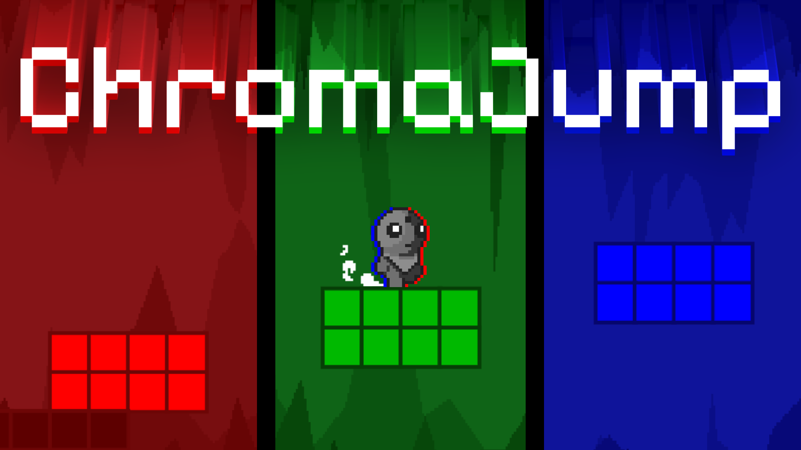

**ChromaJump** is a pixel-art platformer made by **@perhapseb** with [p5play](https://p5play.org/) and [q5.js](https://q5js.org/home/).
Phase platforms in and out with your colour-shifting lenses and traverse through progressively harder levels!

▶️ [Play](https://p5play.org/)

---

## 📖 About

- Only coloured platforms matching your current lens (🔴 Red, 🟢 Green, 🔵 Blue) are visible. 
- Unlock lenses as you progress through the game, each colour bringing a new element to the challenge.
- Swap through lenses on the fly in this colour shifting platformer!

## 🎮 Controls

| Action | Keyboard | Gamepad |
| --- | --- | --- |
| Move left / right | A / D or ← / → | Left Stick |
| Jump | W or Space | A / B |
| Previous / Next Lens | Q / E | LT / RT or X / Y |